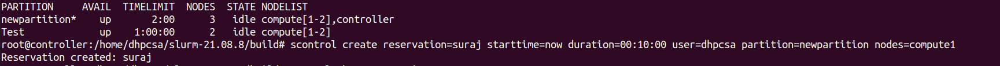
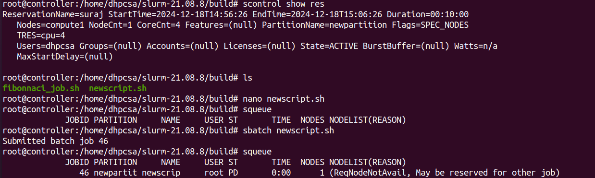
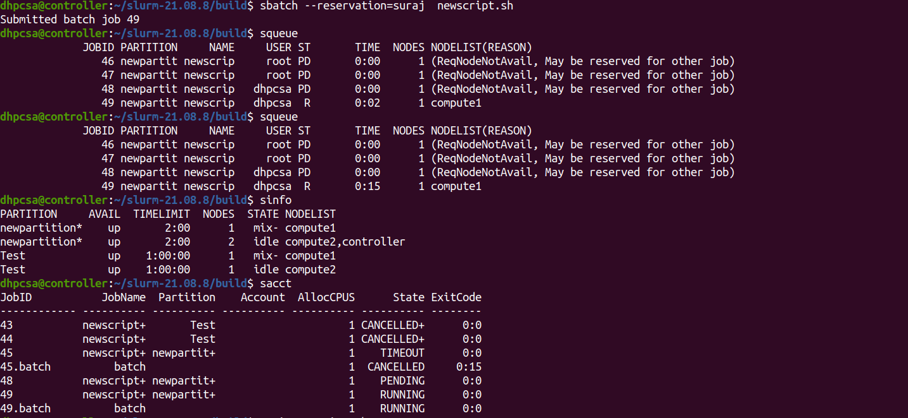
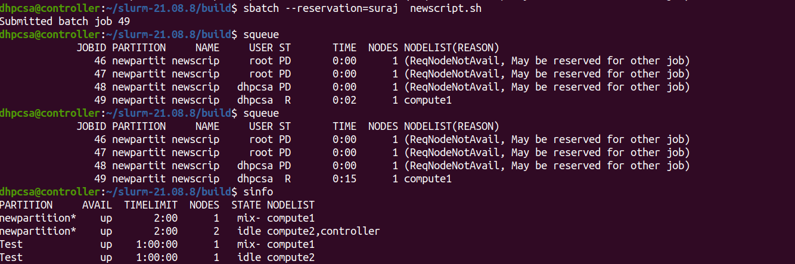

# Slurm Reservation Implementation


## *In the previous setup, we configured Slurm with one controller and two compute nodes. In that environment, we carried out QoS management. Before implementing this, make sure all services are functioning correctly.*


<br>


## Introduction
In a Slurm workload manager, reservations allow users to allocate a specific number of nodes or resources for a specific duration. This can be useful for scheduling jobs that require dedicated compute resources. Here, we'll walk through the process of creating and using a reservation in Slurm, setting up a job on the reservation, and monitoring its status.

## Use Case
This implementation is useful in scenarios where specific users need guaranteed access to resources for jobs, such as for time-critical computations or maintenance tasks. It ensures that only authorized users can submit jobs to the reserved resources, enhancing security and resource management.

## Benefits
- Guaranteed Resources: Ensures that resources are available when needed, without contention from other users.
- Security: Only specific users can access the reservation, preventing unauthorized access.
- Efficient Resource Utilization: Prevents idle nodes by reserving them only for specific purposes.


<br>


### Step 1: Create the Reservation

  - First, we will create a reservation named suraj on the newpartition partition. The reservation will start immediately and last for 10 minutes.


```yml

root@controller:/home/dhpcsa/slurm-21.08.8/build#  scontrol create reservation=suraj starttime=now duration=00:10:00 user=dhpcsa partition=newpartition nodes=compute1


#Output


Reservation created: suraj


```


### Step 2: Check Reservations: Now, let's verify the details of the reservation we just created.

```yml

root@controller:/home/dhpcsa/slurm-21.08.8/build# scontrol show res

# Output should look like

ReservationName=suraj StartTime=2024-12-18T14:56:26 EndTime=2024-12-18T15:06:26 Duration=00:10:00
Nodes=compute1 NodeCnt=1 CoreCnt=4 Features=(null) PartitionName=newpartition Flags=SPEC_NODES
TRES=cpu=4
Users=dhpcsa Groups=(null) Accounts=(null) Licenses=(null) State=ACTIVE BurstBuffer=(null) Watts=n/a
MaxStartDelay=(null)


```


### Step 3: Write a Job Script: 
  - Next, we will create a job script that runs on the reserved partition. This script prints numbers from 1 to 1000 with a sleep interval of 4 seconds between each print.

```yml
root@controller:/home/dhpcsa/slurm-21.08.8/build# nano newscript.sh
```
  - *Add this to  newscript.sh:

```yml
#!/bin/bash
#SBATCH --output=/tmp/fibonacci_%j.out
#SBATCH --error=/tmp/fibonacci_%j.err
#SBATCH --nodelist=compute1
#SBATCH --partition=newpartition
for i in {1..1000}
do
echo $i
sleep 4
done

````


### Step 4: Submit the Job: 
  - Submit the job to the reserved partition.

```yml

dhpcsa@controller:/home/dhpcsa/slurm-21.08.8/build# sbatch --reservation=suraj newscript.sh


#Output

Submitted batch job 49
```
### Step 5: Check Job Status: 
  - Verify that the job is correctly submitted and running on the reserved partition.

```yml

dhpcsa@controller:/home/dhpcsa/slurm-21.08.8/build# squeue

#Output : we can see job get resource ,its running without error

JOBID PARTITION NAME USER ST TIME NODES NODELIST(REASON)
49 newpartition newscript dhpcsa R 0:02 1 compute1

```

### Step 6: Submit a Job as Another User  (in our case we will try to submit job from the root ) (Should Fail):
  - Since the reservation is specific to dhpcsa, any job submission attempt by other users should fail.

```yml

root@controller:~/slurm-21.08.8/build$ sbatch --reservation=suraj newscript.sh
Submitted batch job 48

Output: 

root@controller:/home/dhpcsa/slurm-21.08.8/build# squeue
JOBID PARTITION NAME USER ST TIME NODES NODELIST(REASON)
48 newpartition newscript dhpcsa PD 0:00 1 (ReqNodeNotAvail, May be reserved for other job)

```

### Step 7: Resource Status: Verify the partition status to ensure it is correctly set up and that only authorized users can submit jobs.

```yml

dhpcsa@controller:~/slurm-21.08.8/build$ sinfo

# Output

PARTITION AVAIL TIMELIMIT NODES STATE NODELIST
newpartition* up 2:00 1 mix- compute1
newpartition* up 2:00 2 idle compute2,controller

```

### Step 8: View Accounting Information: Finally, view the accounting information to confirm the reservation and job status.

```yml

dhpcsa@controller:~/slurm-21.08.8/build$ sacct

# output

JobID JobName Partition Account AllocCPUS State ExitCode
------------ ---------- ---------- ---------- ---------- ---------- --------
49 newscript newpartition 1 RUNNING 0:0
49.batch batch 1 RUNNING 0:0                                # second we test from dhpcsa
48 newscript newpartition 1 PENDING 0:0                     # First  we test from root

```
  - We can see other user can't submit job , only dhpcsa (reserved) can submit job on compute1

<br>


  **By following these steps, you can effectively manage reservations in Slurm, ensuring controlled access to resources for specific users and tasks.**


<br>

<br>

<br>


## ------------------Screnshots--------------------
1.
<br>
<br>




2.
<br>
<br>





<br>
<br>

3.
<br>
<br>




4.
<br>
<br>





<br>
<br>


  
